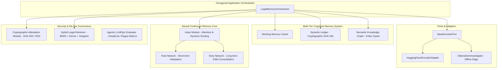

# Continuous Legal Memory Engine

[](https://github.com/vfcarida/continuous-legal-memory/actions/workflows/ci.yml)
[](https://www.python.org/downloads/)
[](#architecture)
[](#compliance--auditability)

A production-ready enterprise cognitive memory framework for persistent LLM legal agents. Features zero-backpropagation online rule ingestion via dual-timescale associative neural adaptation (`ContinuousMemory` + `HopeModule`), multi-tier memory structures (Working, Episodic, Semantic Knowledge Graph), offline-first privacy protection, LegalBench-RAG precision retrieval, cryptographic attestation under the EU AI Act, and DeepEval/Ragas LLMOps evaluation suites.

---

## Technical Architecture Overview



---

## Key Features

### 1. Hexagonal Ports & Adapters (SOLID Architecture)
- **Decoupled Infrastructure**: Core neural memory networks and legal domain logic are isolated from underlying transformer frameworks, vector databases, and API runtimes.
- **Bespoke Exception Hierarchy**: Domain errors (`ContextWindowExceededError`, `MemoryContradictionError`, `TemporalInvalidationError`, `EncoderInferenceError`, `InvalidMemoryVectorError`) enable resilience workflows.

### 2. Multi-Tier Cognitive Memory System
- **Working Memory**: Sliding-window context cache for active legal session turn tracking.
- **Episodic Memory**: Timestamp-backed chronological ledger of immutable legal interactions with SHA-256 hash chaining.
- **Semantic Knowledge Graph**: Entity-typed network (`STATUTE`, `CLAUSE`, `CLIENT_PREFERENCE`) mapping prerequisite dependencies (`DEPENDS_ON`) and logical contradictions (`CONTRADICTS`).

### 3. GDPR Art. 17 & Temporal Compliance
- **Non-Destructive Invalidation**: Updating statutes or client preferences does not execute hard database `DELETE` operations. Instead, records set `valid_to` timestamps and reduce `decay_factor` to `0.0`, preserving an immutable audit log.
- **Temporal Validity Verification**: Automatic timestamp verification guards against stale or expired legal precedents.

### 4. Offline-First Privacy Protection
- **Strict Privacy Mode**: Enforces on-device processing via `OllamaGemmaAdapter` (`http://localhost:11434`), blocking remote endpoints to prevent cloud telemetry and data leakage under attorney-client privilege.

### 5. Precision Hybrid Retrieval & Cryptographic Attestation
- **BM25 + Dense Hybrid Engine**: Combines exact keyword matching with dense vector embeddings and character-level index extraction (`start_char`, `end_char`) to eliminate context bloat (LegalBench-RAG standard).
- **EU AI Act Attestation**: Generates SHA-256 state digests and RSA digital signatures for retrieved memory context states to guarantee auditability for high-risk AI systems.

### 6. LLMOps Agentic Evaluation
- Evaluates **Context Precision**, **Plan Adherence**, and **Cross-Session Recall** via integrated DeepEval/Ragas metric frameworks.

---

## Installation & Setup

```bash
# Clone the repository
git clone https://github.com/vfcarida/continuous-legal-memory.git
cd continuous-legal-memory

# Basic installation
pip install -e .

# Developer & MLOps full installation
pip install -e .[dev,mlops]
```

---

## Quickstart Example

```python
from continuous_legal_memory.orchestrator import LegalMemoryOrchestrator
from continuous_legal_memory.security.attestation import CryptographicAttestationModule

# Initialize the Legal Memory Orchestrator
orchestrator = LegalMemoryOrchestrator(value_dim=2)

ACTION_DELETE = [1.0, 0.0]
ACTION_RETAIN = [0.0, 1.0]

# 1. Ingest baseline privacy legislation into active memory
orchestrator.update_memory(
    rule_text="Article 1: Every client has the right to request deletion of personal data.",
    action_vector=ACTION_DELETE,
)

# 2. Ingest overriding anti-fraud directive without fine-tuning or backprop
orchestrator.update_memory(
    rule_text="New Directive: Deletion of credit operation records active in last 5 years is strictly prohibited.",
    action_vector=ACTION_RETAIN,
)

# 3. Query the model on a specific scenario
query = "Client John paid off a loan last month and demands deletion of his financial credit history."
result = orchestrator.predict(query)

print(f"Query: {result.query}")
print(f"Top Rule: {result.most_relevant_rule}")
print(f"Action Vector (Delete, Retain): {result.predicted_action_vector}")

# 4. Generate cryptographically signed audit attestation under EU AI Act
attestor = CryptographicAttestationModule()
token = attestor.sign_attestation(result)
print(f"Audit State SHA-256 Hash: {token.state_hash}")
print(f"RSA Signature: {token.signature[:32]}...")
```

---

## Verification & Testing

Run the full automated unit test suite and lint checks:

```bash
# Run Pytest suite
pytest tests/unit -v

# Run Ruff linter checks
ruff check continuous_legal_memory tests
```

---

## Author & License

Developed by **Vinicius Caridá** ([vfcarida@gmail.com](mailto:vfcarida@gmail.com)).  
Released under the MIT License.
