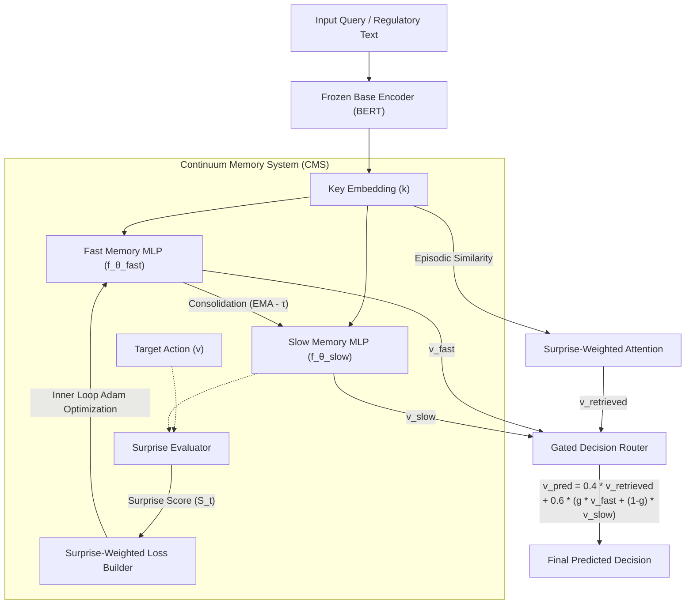

# Continuous Legal Memory via Nested Learning (Titans/HOPE Paradigm)

[](https://www.python.org/downloads/release/python-3120/)
[](https://pytorch.org/)
[](https://huggingface.co/)

A production-grade implementation of **Continuous Legal Memory** based on the **Nested Learning** paradigm presented in NeurIPS 2025 (inspired by the Titans architecture). It allows LLM-based systems to dynamically inject, update, and override regulatory rules at inference time with **zero backpropagation** through the base model, eliminating catastrophic forgetting.

---

## 1. Executive Summary

Traditional LLMs suffer from **catastrophic forgetting** when fine-tuned on new guidelines and fail to handle **precedence conflicts** (e.g., when a new anti-fraud rule overrides a customer's right-to-be-forgotten) using standard linear similarity search or flat attention.

This project implements a **Continuum Memory System (CMS)** featuring **MemoryMLPs** updated via dual-timescale (fast/slow) nested optimization loops. 

### Key Innovations:
1. **Surprise-Gated Local Adaptation**: Captures conflict severity by measuring prediction deviation in the consolidated memory. Surprising rules (conflicting regulations) trigger higher learning rates and epoch adjustments.
2. **Surprise-Weighted Memory Replay**: Weights the loss terms in the inner optimization loop using rule importance, giving overriding regulations a stronger gradient pull and forcing the memory network to prioritize them.
3. **Dual-Timescale Parameter Consolidation**: Employs a Fast Loop (Short-term context) optimized at inference time and a Slow Loop (Long-term consolidation) updated via Exponential Moving Average (EMA).
4. **Hybrid Gated Routing**: Merges direct episodic retrieval with non-linear active predictions using a semantic gating mechanism.

---

## 2. Architecture Overview

The system routes user queries and regulatory rules through a frozen base encoder (BERT) and directs the representations to the dual-timescale memory system.



---

## 3. Mathematical Formulation

### A. Surprise Signal & Rule Importance
When a new regulatory rule $(k_t, v_t)$ is injected, the system evaluates the **prediction surprise** of the consolidated slow network:
$$S_t = \frac{1}{2} \|f_{\theta_{\text{slow}}}(k_t) - v_t\|_2^2$$

This surprise dictates the rule's importance weight ($I_t$), boosting conflicting or new regulations:
$$I_t = 1.0 + 3.0 \cdot S_t$$

### B. Inner Optimization Loop (Fast Loop)
The active weights of the fast network ($\theta_{\text{fast}}$) are optimized over $N$ epochs to minimize the objective function:
$$\mathcal{L}(\theta_{\text{fast}}) = I_t \|f_{\theta_{\text{fast}}}(k_t) - v_t\|_2^2 + 0.7 \sum_{i < t} I_i \|f_{\theta_{\text{fast}}}(k_i) - v_i\|_2^2 + 0.15 \|\theta_{\text{fast}} - \theta_{\text{slow}}\|_2^2$$

Where:
* **Term 1**: Direct adaptation to the newly injected rule (scaled by rule importance).
* **Term 2**: Experience replay on previous rules to safeguard foundational knowledge.
* **Term 3**: Proximal regularization constraining the fast network near the slow network.

### C. Outer Optimization Loop (Slow Loop Consolidation)
Following fast adaptation, parameters consolidate into the long-term slow network ($\theta_{\text{slow}}$) via Exponential Moving Average (EMA):
$$\theta_{\text{slow}} \leftarrow \theta_{\text{slow}} + \tau_{\text{consolidation}} (\theta_{\text{fast}} - \theta_{\text{slow}})$$

### D. Hybrid Gated Routing Inference
For a query $q$, the attention weights are scaled by rule importance:
$$\text{scaled\_scores}_i = \text{cosine\_similarity}(q, k_i) \cdot I_i$$
$$a_i = \text{Softmax}\left(\frac{\text{scaled\_scores}_i}{\text{temperature}}\right)$$
$$v_{\text{retrieved}} = \sum_{i} a_i v_i$$

A dynamic routing gate $g$ routes predictions based on maximum similarity:
$$g = \text{Clamp}\left(\frac{\max_i(\text{similarity}(q, k_i)) - 0.2}{0.6}, 0, 1\right)$$
$$v_{\text{net}} = g \cdot f_{\theta_{\text{fast}}}(q) + (1 - g) \cdot f_{\theta_{\text{slow}}}(q)$$

The final decision is generated by combining episodic retrieval with active neural memory predictions:
$$v_{\text{pred}} = 0.4 \cdot v_{\text{retrieved}} + 0.6 \cdot v_{\text{net}}$$

---

## 4. Installation & Setup

### Prerequisites
* Python 3.10+
* PyTorch 2.0+
* Hugging Face Transformers

### Install Dependencies
```bash
pip install torch transformers huggingface-hub
```

### Run Demonstration Proof of Concept
Run the script to observe the decision flip from `EXCLUIR` to `RETER` when the overriding anti-fraud guideline is injected:
```bash
python poc_continuous_memory.py
```

---

## 5. Automated Verification

The project includes a robust integration and unit test suite targeting edge cases, parameter freezing, input validation, surprise tracking dynamics, and catastrophic forgetting prevention.

### Run Tests
```bash
python -m unittest test_continuous_memory.py
```
