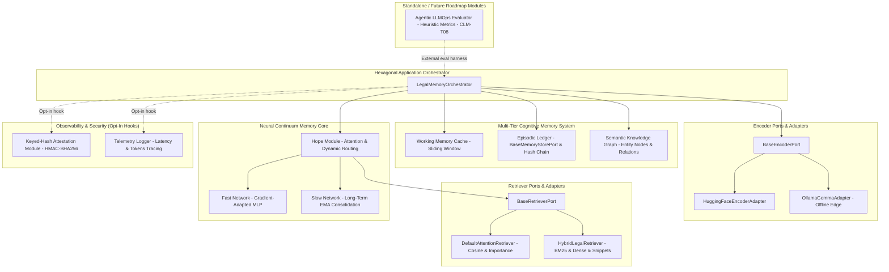

# Continuous Legal Memory Engine

[](https://github.com/vfcarida/continuous-legal-memory/actions/workflows/ci.yml)
[](https://www.python.org/downloads/)
[](#architecture)
[](#current-limitations--roadmap)

A research proof-of-concept cognitive memory framework for legal LLM agents. Features frozen-encoder online rule ingestion via dual-timescale associative neural adaptation (`ContinuousMemory` + `HopeModule`, adapting a small memory head MLP via local gradient descent while the base encoder remains frozen), multi-tier memory structures (Working, Episodic, and Semantic Knowledge Graph prototype), offline-first privacy protection, LegalBench-RAG precision retrieval, and cryptographic attestation & evaluation prototypes.

---

## Technical Architecture Overview


```mermaid
graph TD
    subgraph "Hexagonal Application Orchestrator"
        A[LegalMemoryOrchestrator]
    end

    subgraph "Encoder Ports & Adapters"
        B[BaseEncoderPort] --> C[HuggingFaceEncoderAdapter]
        B --> D[OllamaGemmaAdapter - Offline Edge]
    end

    subgraph "Retriever Ports & Adapters"
        R[BaseRetrieverPort] --> R1[DefaultAttentionRetriever - Cosine & Importance]
        R --> R2[HybridLegalRetriever - BM25 & Dense & Snippets]
    end

    subgraph "Multi-Tier Cognitive Memory System"
        E[Working Memory Cache - Sliding Window]
        F[Episodic Ledger - BaseMemoryStorePort & Hash Chain]
        G[Semantic Knowledge Graph - Entity Nodes & Relations]
    end

    subgraph "Neural Continuum Memory Core"
        H[Hope Module - Attention & Dynamic Routing] --> I[Fast Network - Gradient-Adapted MLP]
        H --> J[Slow Network - Long-Term EMA Consolidation]
    end

    subgraph "Observability & Security (Opt-In Hooks)"
        K[Keyed-Hash Attestation Module - HMAC-SHA256]
        T[Telemetry Logger - Latency & Tokens Tracing]
    end

    subgraph "Standalone / Future Roadmap Modules"
        M[Agentic LLMOps Evaluator - Heuristic Metrics - CLM-T08]
    end

    A --> B
    A --> E
    A --> F
    A --> G
    A --> H
    H --> R
    A -.->|Opt-in hook| K
    A -.->|Opt-in hook| T
    M -.->|External eval harness| A
```

---

## Key Features

### 1. Hexagonal Ports & Adapters (SOLID Architecture)
- **Decoupled Infrastructure**: Core neural memory networks and legal domain logic are isolated from underlying transformer frameworks, vector databases, and storage providers via `BaseEncoderPort`, `BaseRetrieverPort`, and `BaseMemoryStorePort`.
- **Bespoke Exception Hierarchy**: Domain errors (`ContextWindowExceededError`, `MemoryContradictionError`, `TemporalInvalidationError`, `EncoderInferenceError`, `InvalidMemoryVectorError`) enable structured resilience workflows.

### 2. Multi-Tier Cognitive Memory System
- **Working Memory**: Sliding-window context cache for active legal session turn tracking.
- **Episodic Memory**: Timestamp-backed chronological ledger of legal interactions with SHA-256 hash chaining, implementing `BaseMemoryStorePort`.
- **Semantic Knowledge Graph**: Entity-typed network (`STATUTE`, `CLAUSE`, `CLIENT_PREFERENCE`) mapping prerequisite dependencies (`DEPENDS_ON`) and logical contradictions (`CONTRADICTS`), populated during memory ingestion and resolving `source_tier` evaluation.

### 3. Legal Precedence & Hierarchical Conflict Resolution
- **Lex Superior Governance**: Resolves conflicts by hierarchical authority ranks (`authority_rank`, `jurisdiction`) first, explicit `SUPERSEDES` graph relations second, and valid-time recency (*lex posterior*) last within matching authority tiers. Recency alone never overrides higher-authority statutes.
- **Statutory Authority Routing**: When competing candidates exhibit differing authority tiers, the decision is strictly governed by associative retrieval of the superior statute, preventing subordinate neural weights from biasing outputs.

### 4. GDPR Art. 17 Right-to-Erasure & Tombstone Audit Trail
- **Personal Data Confinement**: Rules flagged as personal data (`personal_data=True`) are strictly confined to episodic ledgers and retrieval buffers, completely bypassing parametric absorption into neural network weights (`fast_net`/`slow_net`).
- **Complete Multi-Tier Erasure**: `orchestrator.delete_rule(record_id)` purges records across all 4 tiers (working memory, episodic ledger, semantic graph, neural buffers), appends an immutable SHA-256 tombstone to the cryptographic hash chain, and re-consolidates neural head parameters from retained records, returning a structured audit receipt.

### 5. Durable Cross-Session Persistence (`BaseMemoryStorePort`)
- **SQLite Storage Backend**: Concrete `SqliteMemoryStore` serializes neural key/value/importance buffers, `fast_net`/`slow_net` parameter states, episodic ledger records, semantic graph entities/relations, and hash chains into SQLite.
- **Cross-Process Determinism**: `orchestrator.save_to_disk(path)` and `load_from_disk(path)` reconstruct identical cognitive and neural memory states, reproducing bit-for-bit identical predictions across independent Python sessions.

### 6. Offline-First Privacy Protection
- **Strict Privacy Mode**: Enforces on-device processing via `OllamaGemmaAdapter` (`http://localhost:11434`), blocking remote endpoints to prevent cloud telemetry and data leakage under attorney-client privilege.

### 7. Precision Hybrid Retrieval & Cryptographic Attestation
- **Pluggable Retrieval (`BaseRetrieverPort`)**: Supports both `DefaultAttentionRetriever` (cosine similarity $\times$ rule importance softmax) and `HybridLegalRetriever` (combining BM25 keyword matching, dense vector embeddings, and exact character snippet extraction).
- **Keyed-Hash Attestation (`KeyedHashAttestationModule`)**: Generates deterministic SHA-256 state digests and HMAC-SHA256 integrity tags over retrieved contexts and decision outputs, wired via opt-in orchestrator hook.
- **Observability & Telemetry (`TelemetryLogger`)**: Traces pipeline latency and estimated token processing per operation, wired via opt-in orchestrator hook.

### 8. Systematic Evaluation Harness & Baselines (CLM-T08)
- **Multi-Baseline Comparison**: The `EvaluationHarness` tests memory against 5 standard baselines: No-Memory, Bounded-History ($k=3$), Plain RAG (vector-only), Temporal Structured (retrieval + legal precedence), and Hybrid Continuum Memory (full CMS).
- **Synthetic Ground-Truth Benchmark**: Evaluated across 60 synthetic legal directives and 40 multi-scenario queries (`tests/fixtures/synthetic_legal_benchmark.jsonl`), testing authority hierarchies, explicit supersession, temporal expiration, right-to-erasure, adversarial poisoning, and multi-tenant cross-talk.
- **Statistical Rigor**: Runs across $\ge 20$ random initialization seeds with mean $\pm$ std reporting.
- **Full Benchmark Report**: Complete empirical findings and ablation sweeps are documented in [`docs/evaluation_report.md`](docs/evaluation_report.md).

---

## Current Limitations & Roadmap

This project is an experimental research proof-of-concept exploring neural-associative continuous legal memory. The following limitations and empirical findings are documented on the development roadmap:

- **Empirical Evidence on Parametric Adaptation**: Systematic benchmarking across 20 seeds demonstrates that deterministic structured retrieval (`TemporalStructured` accuracy 85.3%) outperforms the hybrid parametric memory head (76.0%), while eliminating initialization variance. In production legal settings, deterministic structured retrieval is safer and more accurate than adapting parametric weights online.
- **Parametric Unlearning & Personal Data**: In-place machine unlearning in continuous neural networks is notoriously unreliable. Continuous Legal Memory addresses this by strictly isolating personal data from parametric weights at ingestion time; complete erasure purges the retrieval tiers and re-consolidates the memory head from retained records.
- **Keyed Hash vs. Asymmetric Signatures**: The attestation module implements symmetric HMAC-SHA256 with key configuration (shared secret or environment variable) for single-trust domain auditability. True asymmetric PKI signatures (e.g., Ed25519/RSA-PSS) with public-key distribution require external cryptographic libraries and are scoped as future work.
- **Multi-Tenancy & Authorization**: As demonstrated by adversarial tenant-isolation probes in the evaluation harness, memory tiers do not currently enforce tenant isolation boundaries, resulting in cross-tenant leakage if distinct client data shares an orchestrator instance. Multi-tenant partitioning is a P0 roadmap item.

---

## Installation & Setup

```bash
# Clone the repository
git clone https://github.com/vfcarida/continuous-legal-memory.git
cd continuous-legal-memory

# Basic installation (Python 3.10+)
pip install -e .

# Developer installation
pip install -e .[dev]

# CLI Verification
clm --help
clm serve --host 127.0.0.1 --port 8000 --mock-encoder

# Container Deployment
docker compose up -d
```

---

## Quickstart Example

```python
from continuous_legal_memory.orchestrator import LegalMemoryOrchestrator
from continuous_legal_memory.security.attestation import CryptographicAttestationModule

# Initialize the Legal Memory Orchestrator
orchestrator = LegalMemoryOrchestrator(value_dim=2)

ACTION_DELETE = [1.0, 0.0]
ACTION_RETAIN = [0.0, 1.0]

# 1. Ingest baseline privacy legislation into active memory
orchestrator.update_memory(
    rule_text="Article 1: Every client has the right to request deletion of personal data.",
    action_vector=ACTION_DELETE,
)

# 2. Ingest overriding anti-fraud directive (frozen base encoder; adapts memory head without LLM fine-tuning)
orchestrator.update_memory(
    rule_text="New Directive: Deletion of credit operation records active in last 5 years is strictly prohibited.",
    action_vector=ACTION_RETAIN,
)

# 3. Query the model on a specific scenario
query = "Client John paid off a loan last month and demands deletion of his financial credit history."
result = orchestrator.predict(query)

print(f"Query: {result.query}")
print(f"Top Rule: {result.most_relevant_rule}")
print(f"Action Vector (Delete, Retain): {result.predicted_action_vector}")

# 4. Generate audit attestation token (keyed-hash integrity tag)
attestor = CryptographicAttestationModule()
token = attestor.sign_attestation(result)
print(f"Audit State SHA-256 Hash: {token.state_hash}")
print(f"Keyed-Hash Tag: {token.signature[:32]}...")
```

---

## Verification & Testing

Run the automated unit test suite and lint checks:

```bash
# Run Pytest offline test suite
pytest tests/unit/test_domain.py tests/unit/test_ollama_adapter.py tests/unit/test_phase2_memory_tiers.py tests/unit/test_phase3_retrieval_and_mlops.py -v

# Run Ruff linter checks
ruff check continuous_legal_memory tests
```

---

## Author & License

Developed by **Vinicius Caridá** ([vfcarida@gmail.com](mailto:vfcarida@gmail.com)).  
Released under the MIT License.
