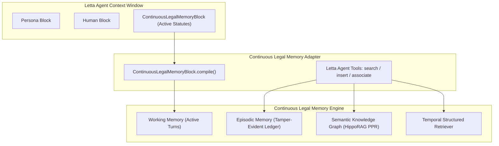

# Letta (MemGPT) Integration Guide

This guide describes how to integrate **Continuous Legal Memory (CLM)** into **Letta** (formerly known as MemGPT) autonomous agent workflows.

---

## 1. Overview

[Letta](https://github.com/letta-ai/letta) organizes long-term agent memory into structured, editable **Memory Blocks** within the LLM's context window. While default Letta blocks (such as `persona` and `human`) handle conversational identity, enterprise and legal agents require deterministic statutory governance, temporal bounds checking, and multi-hop legal relationship discovery.

`ContinuousLegalMemoryBlock` and `create_letta_tools` provide:

1. **Context Window Block Compilation**: Auto-summarizes active legal directives and client preferences with strict character budget truncation.
2. **Deterministic Legal Reasoning**: Queries are backed by CLM's hierarchical authority ranking (*lex superior*) and temporal validity engines.
3. **HippoRAG Personalized PageRank (PPR)**: Allows autonomous agents to discover prerequisite clauses, statutory exceptions, and regulatory dependencies via graph diffusion.
4. **Multi-Tenant Scoping**: All block reads, tool queries, and knowledge graph diffusions are strictly partitioned by tenant ID.

---

## 2. Architecture



---

## 3. Using `ContinuousLegalMemoryBlock`

The memory block interface exposes the `.compile()` and `.value` properties expected by Letta agents, rendering active directives into a concise Markdown string.

### Basic Setup

```python
from continuous_legal_memory.orchestrator import LegalMemoryOrchestrator
from continuous_legal_memory.adapters.ollama import OllamaGemmaAdapter
from continuous_legal_memory.integrations.letta import ContinuousLegalMemoryBlock

# 1. Initialize Orchestrator
encoder = OllamaGemmaAdapter(host_url="http://localhost:11434")
orchestrator = LegalMemoryOrchestrator(
    encoder=encoder,
    value_dim=2,
    engine_mode="structured",
)

# 2. Ingest Governing Directives
orchestrator.update_memory(
    rule_text="Article 15 GDPR: Right of access by data subjects.",
    action_vector=[1.0, 0.0],
    authority_rank=8,
    tenant_id="enterprise_client",
)

# 3. Create Letta Memory Block
legal_block = ContinuousLegalMemoryBlock(
    orchestrator=orchestrator,
    name="legal_statutes",
    label="legal_compliance",
    limit=2000,
    tenant_id="enterprise_client",
)

# 4. View Compiled Block in Agent Prompt
print(legal_block.compile())
# Output:
# [Legal Precedence Memory - Active Directives]
# - (Rank 8) Article 15 GDPR: Right of access by data subjects.
```

---

## 4. Letta Agent Tools

`create_letta_tools` generates callable, typed tool functions ready for registration with Letta or OpenAI function-calling agent loops.

```python
from continuous_legal_memory.integrations.letta import create_letta_tools

# Create tools scoped to the client tenant
tools = create_letta_tools(
    orchestrator=orchestrator,
    tenant_id="enterprise_client",
)
```

The resulting dictionary contains three primary tools:

### `legal_memory_search(query: str) -> str`
Searches continuous memory for governing rules and decision vectors:

```python
result_str = tools["legal_memory_search"]("Can a user inspect data held about them?")
print(result_str)
# Governing Rule: Article 15 GDPR: Right of access by data subjects.
# Action Vector: [1.0, 0.0]
# Snippets: ['Article 15 GDPR: Right of access by data subjects.']
```

### `legal_memory_insert(rule_text: str, action_vector: list[float], authority_rank: int = 1) -> str`
Ingests a new legal directive or compliance constraint:

```python
confirmation = tools["legal_memory_insert"](
    rule_text="Internal Security Policy 4.2: Encrypt all data exports with AES-GCM.",
    action_vector=[1.0, 0.0],
    authority_rank=4,
)
print(confirmation)
# Successfully ingested rule '6b4...' (Rank 4).
```

### `legal_memory_associate(seed_clause_id: str) -> str`
Performs HippoRAG Personalized PageRank (PPR) over the knowledge graph to return topologically linked regulatory prerequisites:

```python
associations = tools["legal_memory_associate"]("gdpr_art15")
print(associations)
# Associations for gdpr_art15:
# - [statute] gdpr_art15: Right of access (PPR: 0.5231)
# - [guideline] edpb_guidelines: EDPB 01/2022 on Data Subject Rights (PPR: 0.3120)
# - [obligation] identity_verification: Verify requester identity before release (PPR: 0.1649)
```

---

## 5. Multi-Tenant Agent Security

In multi-tenant autonomous deployments (such as legal platforms serving multiple corporate law firms), pass `tenant_id` to `ContinuousLegalMemoryBlock` or `create_letta_tools`.

- **Ledger Scoping**: Queries cannot retrieve records or working memory outside the specified tenant namespace.
- **Graph Isolation**: PageRank teleportation and transition probabilities are mathematically bounded to nodes within the tenant's partition.
- **GDPR Erasure**: Right-to-erasure commands strictly verify tenant ownership before issuing cryptographic tombstones.
